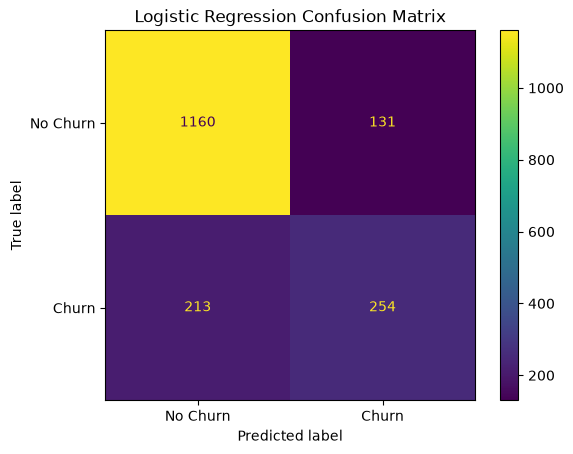
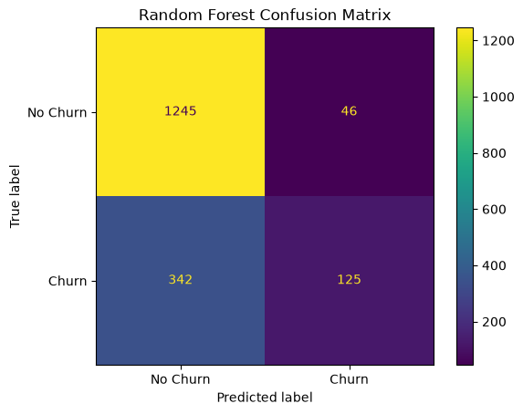

# Customer Churn Prediction

## Project Overview

A machine learning project that predicts customer churn using demographic, service, contract, and billing-related information.

The project compares multiple classification algorithms, applies data preprocessing and hyperparameter tuning, and evaluates model performance using classification metrics.

## Project Objective

The primary objective is to identify customers who are likely to churn and support data-driven customer retention strategies.

### Key Objectives

- Analyze customer data and identify churn-related patterns.
- Perform data preprocessing and exploratory data analysis.
- Train multiple machine learning classification models.
- Apply hyperparameter tuning using GridSearchCV.
- Compare models using classification metrics.
- Save the trained model and preprocessing scaler.

---

## Setup & Execution Instructions

### Requirements

- Python 3.8+
- Jupyter Notebook
- pandas
- numpy
- matplotlib
- seaborn
- scikit-learn
- xgboost
- joblib

### How to Run

1. Clone the repository.
2. Install the required dependencies.
3. Open `Customer_Churn_Prediction.ipynb`.
4. Run the notebook cells sequentially.
5. Review the model evaluation results and visualizations.

### Installation

```bash
pip install -r requirements.txt
```

---

## Dataset

### Telco Customer Churn Dataset

The dataset contains customer information related to demographics, account details, services, contracts, and billing.

### Dataset Features

- Customer demographics
- Account information
- Internet and phone services
- Contract details
- Payment methods
- Monthly and total charges

### Target Variable

**Churn:** Indicates whether a customer has left the company.

- `Yes` — Customer churned
- `No` — Customer remained

---

## Data Preprocessing

The following preprocessing steps were performed:

1. Checked and handled missing values.
2. Converted data types where required.
3. Encoded categorical features.
4. Separated input features and target variable.
5. Split the dataset into training and testing sets.
6. Applied feature scaling where required.

## Exploratory Data Analysis

Exploratory data analysis was performed to understand customer characteristics and identify patterns related to churn.

The analysis included:

- Churn distribution.
- Numerical feature analysis.
- Categorical feature analysis.
- Correlation analysis.
- Data visualization.

---

## Methodology Overview

### Machine Learning Models

| Model | Description |
|---|---|
| Logistic Regression | Classification model used as the primary model |
| Decision Tree | Tree-based classification algorithm |
| Random Forest | Ensemble of multiple decision trees |
| XGBoost | Gradient boosting classification algorithm |

### Model Training

The models were trained using the preprocessed dataset.

Hyperparameter optimization was performed using **GridSearchCV** to identify suitable model parameters.

### Hyperparameter Tuning

GridSearchCV was used to evaluate different hyperparameter combinations through cross-validation.

### Evaluation Metrics

The models were evaluated using:

- Accuracy
- Precision
- Recall
- F1-Score
- Confusion Matrix

---

## Experimental Results

Multiple machine learning models were trained and evaluated using classification metrics.

### Model Comparison

| Model | Accuracy | Precision | Recall | F1-Score |
|---|---:|---:|---:|---:|
| Logistic Regression | 80.43% | 66% | 54% | 60% |
| Decision Tree | 78.84% | 70% | 36% | 47% |
| Random Forest | 77.93% | 73% | 27% | 39% |
| XGBoost | 80.15% | 66% | 51% | 58% |

### Selected Model

Logistic Regression was selected as the primary model based on the project objective and observed evaluation results.

The model provides a balance between precision, recall, and overall classification performance.

### Results File

Detailed model comparison results are available in:

`results/model_comparison.csv`

---

## Key Findings

- Multiple classification models were trained and compared.
- Logistic Regression achieved an accuracy of approximately 80.43%.
- Model performance was evaluated using precision, recall, and F1-score.
- Confusion matrices were generated to analyze classification errors.
- The trained Logistic Regression model and scaler were saved for future use.

---

## Visualizations

### Confusion Matrices

#### Logistic Regression



#### Random Forest



The confusion matrices illustrate true positives, true negatives, false positives, and false negatives.

---

## Repository Structure

```text
Customer-Churn-Prediction/
│
├── images/
│   ├── logistic_regression_cm.png
│   └── random_forest_cm.png
│
├── models/
│   ├── final_logistic_model.pkl
│   └── scaler.pkl
│
├── results/
│   └── model_comparison.csv
│
├── Customer_Churn_Prediction.ipynb
├── README.md
└── requirements.txt
```

### Project Components

- `Customer_Churn_Prediction.ipynb` — Complete machine learning workflow.
- `models/` — Saved trained model and scaler.
- `images/` — Confusion matrix visualizations.
- `results/` — Model comparison results.
- `requirements.txt` — Required Python libraries.

---

## Saved Models

The following model artifacts were saved:

- `final_logistic_model.pkl` — Trained Logistic Regression model.
- `scaler.pkl` — Feature preprocessing scaler.

These files can be used for future prediction and deployment workflows.

---

## Limitations

- Model performance depends on the dataset quality and feature representation.
- Churn predictions may contain false positives and false negatives.
- The current project focuses on offline model evaluation.
- A deployed prediction API and user interface are not included in the current version.

---

## Future Improvements

- Develop a web-based churn prediction application.
- Deploy the model using Flask or FastAPI.
- Improve feature engineering.
- Experiment with additional machine learning algorithms.
- Monitor model performance using new customer data.

---

## Conclusion

This project demonstrates a complete machine learning workflow for customer churn prediction, including data preprocessing, exploratory data analysis, model training, hyperparameter tuning, and performance evaluation.

The project provides a foundation for developing customer retention and predictive analytics solutions.